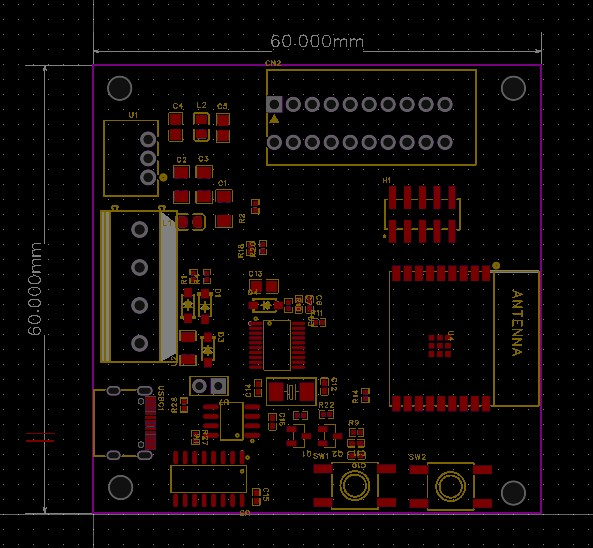
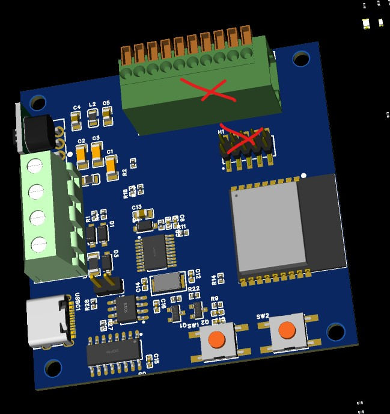

# Overview
I started to create a PCB to control my heatpump via CAN-bus, based on this [ESPHome project](https://github.com/roberreiter/StiebelEltron-heatpump-over-esphome-can-bus):

After seeing many posts regarding how to properly connect hardware (and of course doing this with jumper wires), I decided to go more public with my design - maybe it will help others :)

I have a professional background in electrical engineering, but I do mostly research FPGA at work. So there may be some mistakes in the schematics. While drawing the schematics I tried to comment my design decisions. If you see any errors or possible pitfalls, please tell me or ask me why ;)

So, if there is enough interest, I would think about ordering more than 5 and putting the PCB on tindie.com - depends your feedback :)

# Features
- ESP C3 Wroom 2-N4 
  - ESP Home support
  - hardware also supports the upcoming Matter protocol (over WIFI)
- USB Type C for programming (CH340C for USB to UART)
- Power Supply:
  - Wide range 5..30V switched input via Mornsun K78L03-500R3 (omitting the standard 3V3 LDO, so it should be very energy-efficient!)
  - Short and Reverse input protection
  - resettable input fuse
  - made sure that every component has decoupling capacitors (I was terrified, seeing that most evaluation kits don't have them)
- CAN Bus: 
  - Input (CAN high/Low, VCC, GND) via screw terminal 
  - 3V3 CAN transceiver TI SN65HVD230, compatible with 5V CAN Bus systems [very technical link](https://www.analog.com/en/technical-articles/can-bus-transceivers-operate-from-33v-or-5v-and-withstand-60v-faults.html) 
  - well known and supported MCP2515 CAN Controller (integrated in ESP Home)
  - options to bypass the CAN controller via 0Ohm resistors 
- 4 LEDs (Power, RX, TX and ESP LED)
- Optional: There are additional spring clamps and one 10p 2mm pin header on the board - I need them for other projects :)

# Current status
- [Schematics almost ready](2023-03-17_Schematic_ESP32-CAN_draft.pdf). Will review at them again, soon 
- Basic placement is done. Routing not started, but it will fit on a one-side PCB smaller than 60x60mm. 

- Looking for suitable housings to determine the PCB dimensions. I have a sample of a Phoenix Contact UCS 145-125, which is really robust, but with around 25€ it costs would be more than the PCB...  Any ideas? It is also possible to do a cheap 3D printed housing includind a strain relief for the CAN-input-wires, but I don't have a 3D printer and certainly would need help with that. 

Waiting for your feedback :)
Feel free to open issues or use the [Home Assistant community thread:](https://community.home-assistant.io/t/pcb-design-esp32-to-can-supporting-esphome-matter/549125)

~Martin 