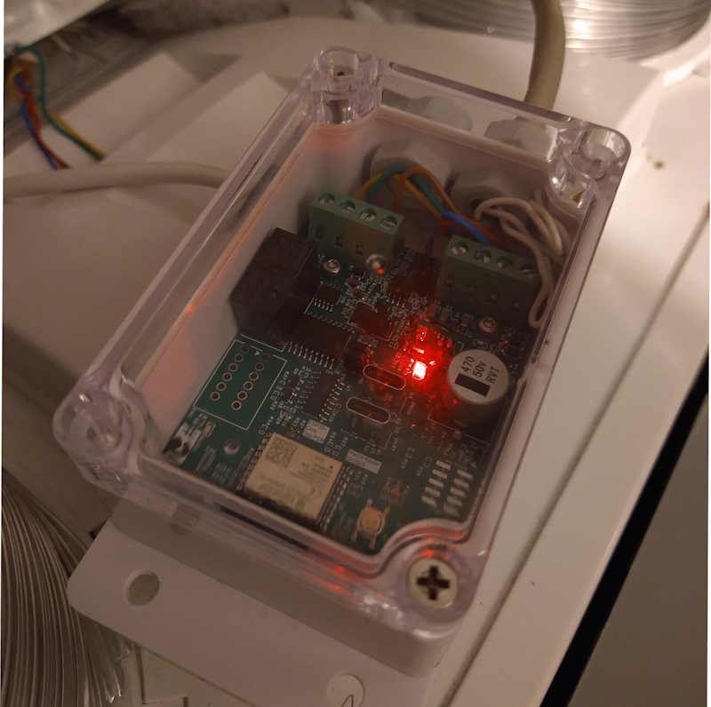
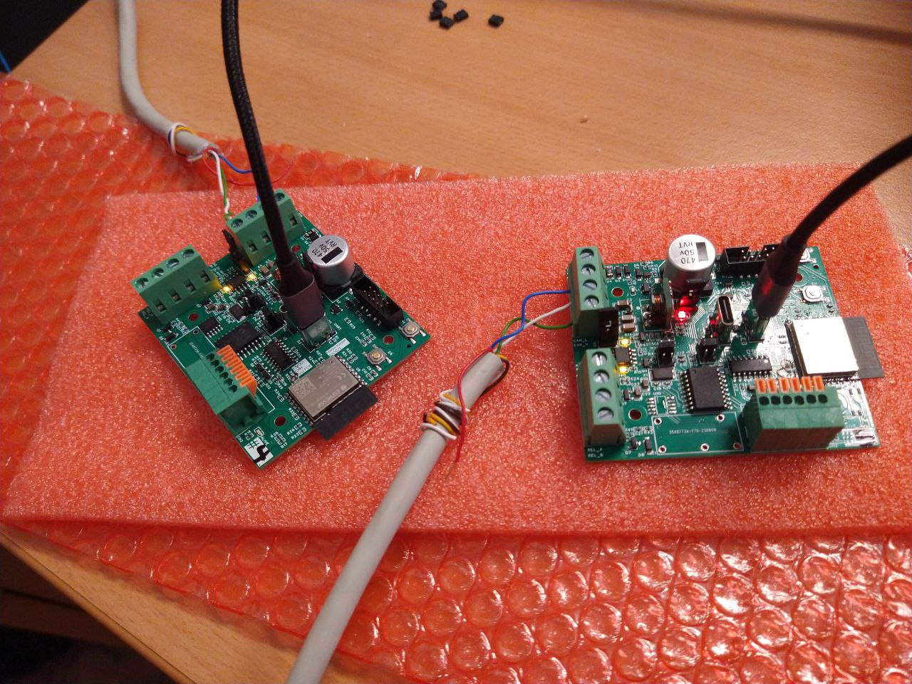
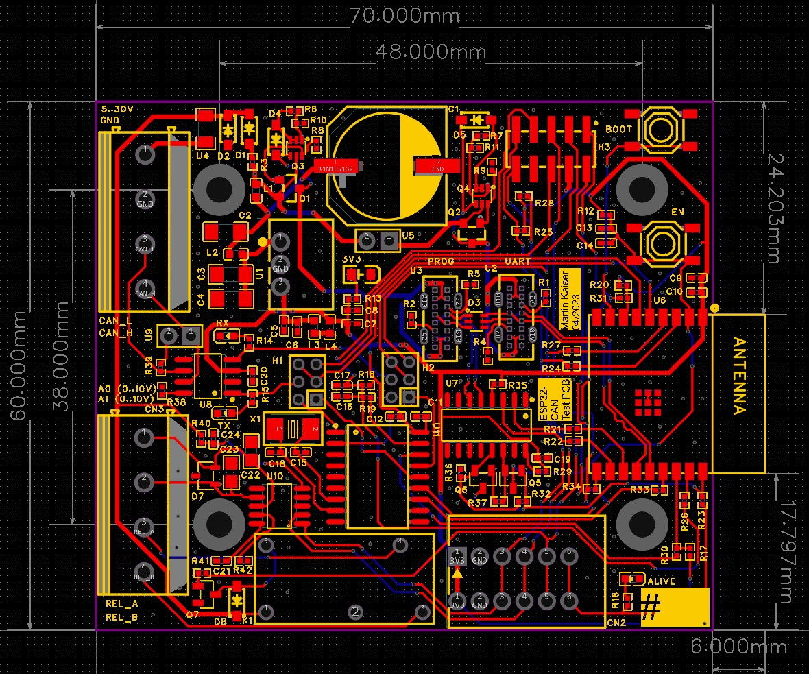
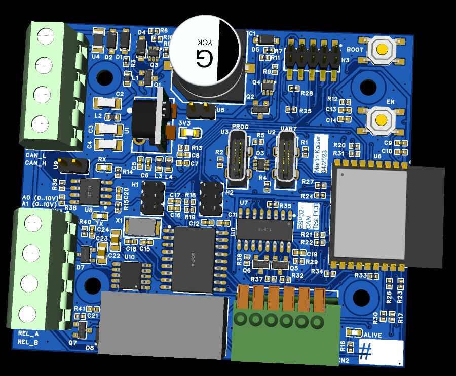

# Overview
I started to create a PCB to control my heatpump via CAN-bus, based on this [ESPHome project](https://github.com/roberreiter/StiebelEltron-heatpump-over-esphome-can-bus):

After seeing many posts regarding how to properly connect hardware (and of course doing this with jumper wires), I decided to go more public with my design - maybe it will help others

I have a professional background in electrical engineering, but I do mostly research FPGA at work. So there may be some mistakes in the schematics. While drawing the schematics I tried to comment my design decisions. If you see any errors or possible pitfalls, please tell me or ask me why.

You can find some developent notes on this in the [Home Assistant Community Forum](https://community.home-assistant.io/t/pcb-design-esp32-to-can-supporting-esphome-matter/)

I am planing to make a new revision in a couple of month. Give me some feedback and I will try to incorporate it.

# Features
* ESP C3 Wroom 2-N4 
  * ESP Home support
  * Hardware supports the upcoming Matter protocol (over WIFI)
* 2x USB Type C 
  * Direct ESP programming (have never tested this before)
  * Programming via CH340C (USB to UART)
  * Each USB port can power the board (5V, 1A)
* Power Supply
  * Wide range 5..30V input via Mornsun K78L03-500R3 (switched regulator, omitting the standard 3V3 LDO used in most Arduino development boards, so it should be very energy-efficient!)
  * Short and reverse input protection
  * Both USB ports and 24V input can be used in parallel without causing backpower problems
  * Resettable input fuse
  * Made sure that every component has proper decoupling capacitors (I am terrified, seeing most evaluation kits without them)
* CAN Bus
  * Input (CAN high/Low, VCC, GND) via screw terminal 
  * CAN transceiver TI SN65HVD230, compatible with 3V3 and 5V CAN Bus systems [very technical link](https://www.analog.com/en/technical-articles/can-bus-transceivers-operate-from-33v-or-5v-and-withstand-60v-faults.html) 
  * Two CAN options, configurable via Jumper
    * ESP internal CAN controller 
    * External MCP2515 CAN Controller
* 4 LEDs (Power, RX, TX and ESP LED)
* Mechanical housing: Designed the PCB to fit a cheap and robust "SONOFF IP66 waterproof Junction Box” from Aliexpress.
* Additional / Optional
  * There are additional spring clamps and one 10p 2mm pin header on the board - for creating testbeds for other peripherals / sensors/actuators
  * I added one I2C-attached IC (GP8403-TC50) to realise 2 analog output ports with 0…10V DC output. In combination with a potential free relay, I can control my ventilation system (Tecalor TVZ 170 E Plus).

# Features revision 2 (planning ahead)
* Fix errata list from revision 1
* ESP32 C6 Mini
* Only use the internal ESP32 USB CDC port (omit the CH340)
* Maybe use the [MCP251863 CAN FD Controller with included transceivers](https://www.microchip.com/en-us/product/mcp251863). Selecting the CAN mode (internal ESP32 or MCP2518) is still possible by Jumper. But I am a bit afraid of the ESPHome Software support). Can someone help me with this?

# Current status (2023-07-14)
* Manufactured 5 test PCBs at JLCPCB
* [Schematic with errata here](rev1_2023-05/2023-07-14._Schematic_rev0_errata_.pdf)
* Errors (minor)
  * Used inductors in power input path with too low max. current (3mA, but required are > 300mA). Solved by simply bypassing them. Power is stable enough with the decoupling caps. 
  * Double Crossed RX/TX line of UART. Fixable by thread wire
  * LEDs
    * Alive LED "LED4" should be driven via transistor. This way it could interfere with the RTS / DRT circuit (but it works in practise!)
    * RX CAN LED is logical '1', if the bus is IDLE --> Change circuit to drive the LED active low (just blink, if there is ongoing communication)
    * TX LED can be ommited. RX LED is covering also TX
  * PCB Layout 
    * Switched label for USB UART (via CH340) and USB PROG (via ESP32 CDC)
    * Two Mounting holes are a bit off and the PCB could be 1mm more narrow to better fit the SONOFF case. --> two screw also work, but will fix in the next revision
    * MYS Pin Header is placed over some resistors (still works, but also not nice)

# Documentation 
* [Schematic with errata](rev1_2023-05/2023-07-14._Schematic_rev0_errata_.pdf)
* [PCB Overview and Jumper Settings](PCB_Overview_and_Jumper_Settings)
* [ESPHome CANopen Testcode](https://github.com/mkaiser/esphome-canopen/tree/simple)

# Some pictures
Ventilation controller based on the PCB 

Testing two nodes interconnected via [ESPHome CANopen](https://github.com/mkaiser/esphome-canopen/tree/simple)

PCB Layout

3D Rendering

Waiting for your feedback and maybe wishes for the next revision :)
Feel free to use the github forum or use the [Home Assistant community thread:](https://community.home-assistant.io/t/pcb-design-esp32-to-can-supporting-esphome-matter/549125)

~Martin 
