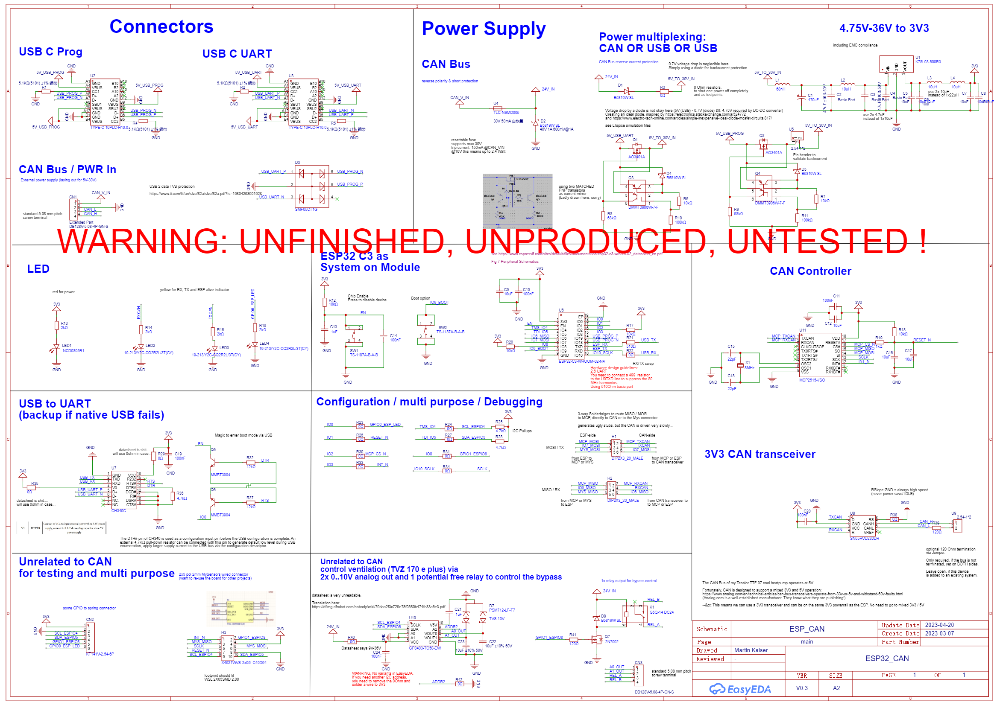
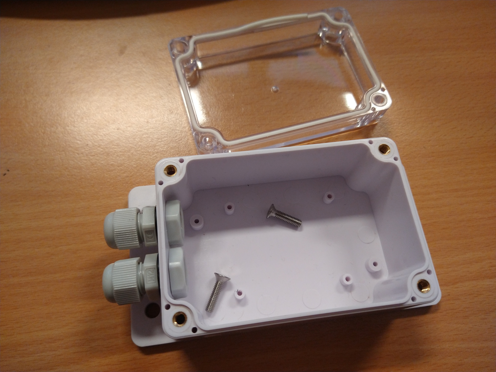

# Overview
I started to create a PCB to control my heatpump via CAN-bus, based on this [ESPHome project](https://github.com/roberreiter/StiebelEltron-heatpump-over-esphome-can-bus):

After seeing many posts regarding how to properly connect hardware (and of course doing this with jumper wires), I decided to go more public with my design - maybe it will help others :)

I have a professional background in electrical engineering, but I do mostly research FPGA at work. So there may be some mistakes in the schematics. While drawing the schematics I tried to comment my design decisions. If you see any errors or possible pitfalls, please tell me or ask me why ;)

So, if there is enough interest, I would think about ordering more than 5 and putting the PCB on tindie.com - depends your feedback :)

# Features
- ESP C3 Wroom 2-N4 
  - ESP Home support
  - Hardware supports the upcoming Matter protocol (over WIFI)
- 2x USB Type C 
  - Direct ESP programming (have never tested this before)
  - Programming via CH340C (USB to UART)
  - Each USB port can power the board (5V, 1A)
- Power Supply
  - Wide range 5..30V switched input via Mornsun K78L03-500R3 (omitting the standard 3V3 LDO, so it should be very energy-efficient!)
  - Short and reverse input protection
  - USB ports and 24V input can be used in parallel without causing backpower problems
  - Resettable input fuse
  - Made sure that every component has proper decoupling capacitors (I was terrified, seeing that most evaluation kits don't have them)
- CAN Bus
  - Input (CAN high/Low, VCC, GND) via screw terminal 
  - 3V3 CAN transceiver TI SN65HVD230, compatible with 3V3 and 5V CAN Bus systems [very technical link](https://www.analog.com/en/technical-articles/can-bus-transceivers-operate-from-33v-or-5v-and-withstand-60v-faults.html) 
  - Well known and supported MCP2515 CAN Controller (integrated in ESP Home)
  - Options to bypass the CAN controller via 0Ohm resistors 
- 4 LEDs (Power, RX, TX and ESP LED)
- Additional / Optional
  - There are additional spring clamps and one 10p 2mm pin header on the board - I need them for other projects :)
  – I added one I2C-attached IC (GP8403-TC50) to realise 2 analog output ports with 0…10V DC output. In combination with a potential free relay, I can control my ventilation system (Tecalor TVZ 170 E Plus).

# Current status
- [Schematics finished (pdf link)](2023-04-20_JLCPCB/SCH_ESP_CAN_2023-04-20.pdf). Will update the schematics, if I find any errors after manifacturing. 

- [Layout finished (2D pdf link)](2023-04-20_JLCPCB/PCB_PCB6_2023-04-20.pdf). 

Designed the PCB to fit a cheap and robust "SONOFF IP66 waterproof Junction Box” from Aliexpress. Measuring the housing was a bit tricky. I hope it works. 

Waiting for your feedback :)
Feel free to open issues or use the [Home Assistant community thread:](https://community.home-assistant.io/t/pcb-design-esp32-to-can-supporting-esphome-matter/549125)

~Martin 